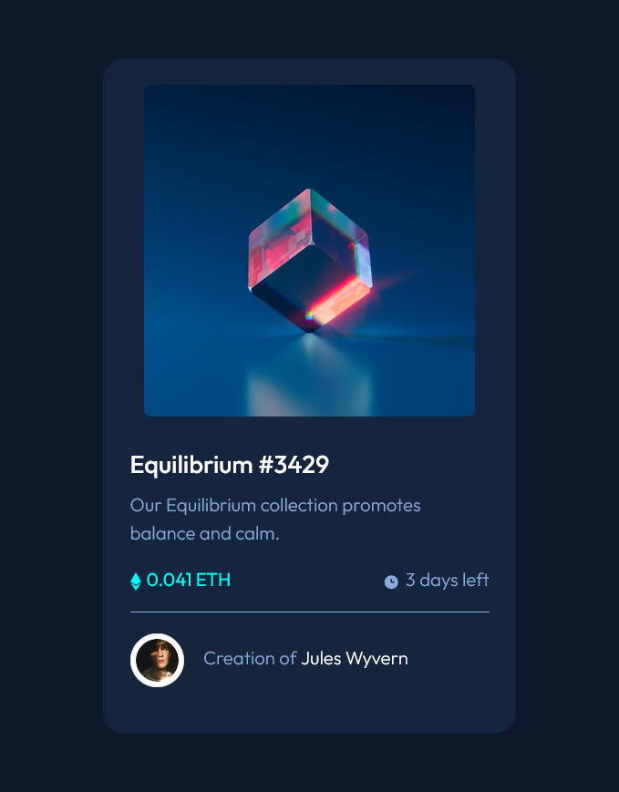

# Frontend Mentor - NFT preview card component solution

This is a solution to the [NFT preview card component challenge on Frontend Mentor](https://www.frontendmentor.io/challenges/nft-preview-card-component-SbdUL_w0U). Frontend Mentor challenges help you improve your coding skills by building realistic projects. 

## Table of contents

- [Overview](#overview)
  - [The challenge](#the-challenge)
  - [Screenshot](#screenshot)
  - [Links](#links)
- [My process](#my-process)
  - [Built with](#built-with)
  - [Useful resources](#useful-resources)
- [Author](#author)

## Overview

### The challenge

Your challenge is to build out this preview card component and get it looking as close to the design as possible.

Users should be able to:

- View the optimal layout depending on their device's screen size
- See hover states for interactive elements

### Screenshot

### Links

- Frontend Mentor Solution -> https://www.frontendmentor.io/solutions/nft-preview-card-hp1hvYOmmn
- Live Site -> https://natashaac.github.io/Challenge-NFT_Preview_Card/

## My process

### Built with

- Semantic HTML5 markup
- CSS custom properties
- Bootstrap

### Useful resources

- [w3schools](https://www.w3schools.com)
- [Bootstrap](https://getbootstrap.com/docs/5.3/components/card/)

## Author

- Website - [Natasha Chambers Portfolio](https://natashaagathachambers.com/)
- Frontend Mentor - [@NatashaAC](https://www.frontendmentor.io/profile/NatashaAC)
